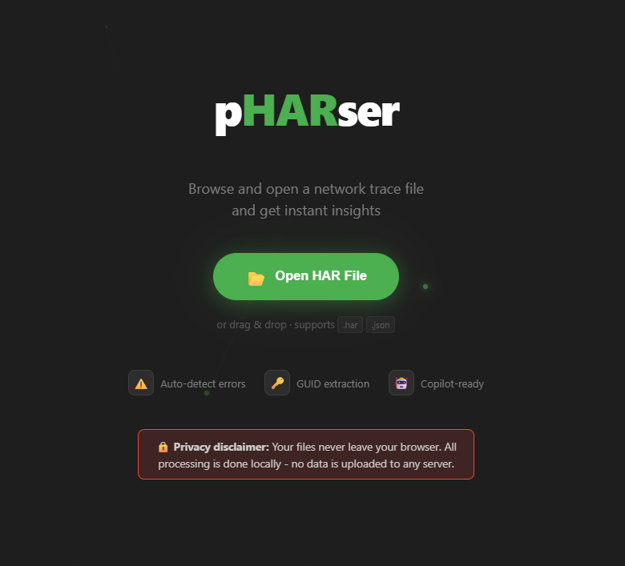
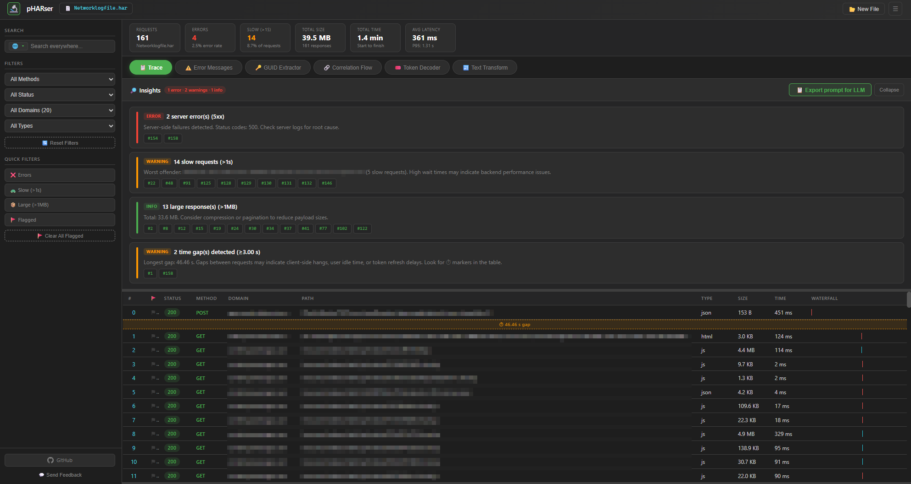
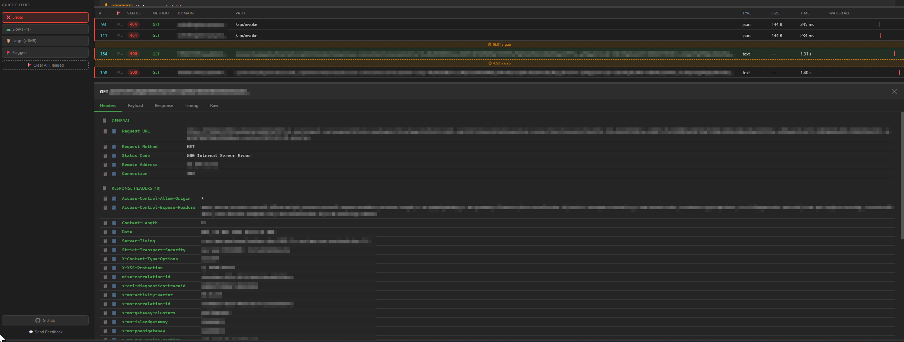
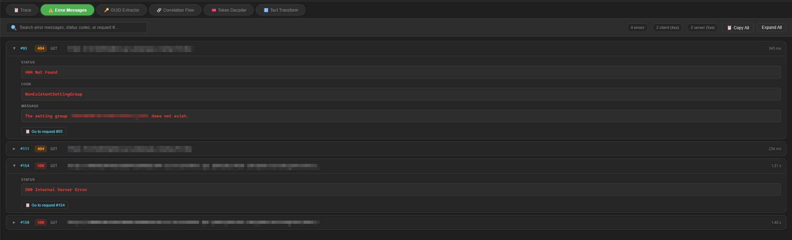
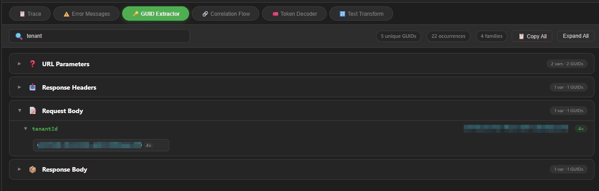
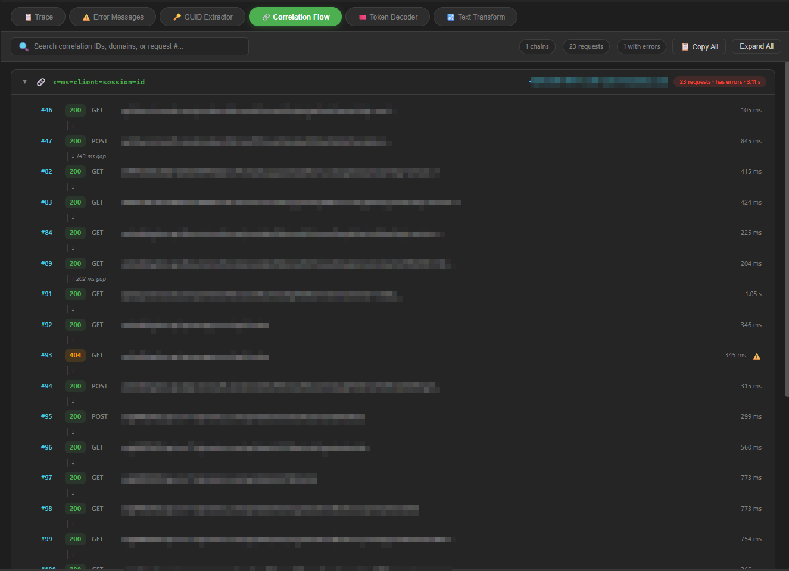
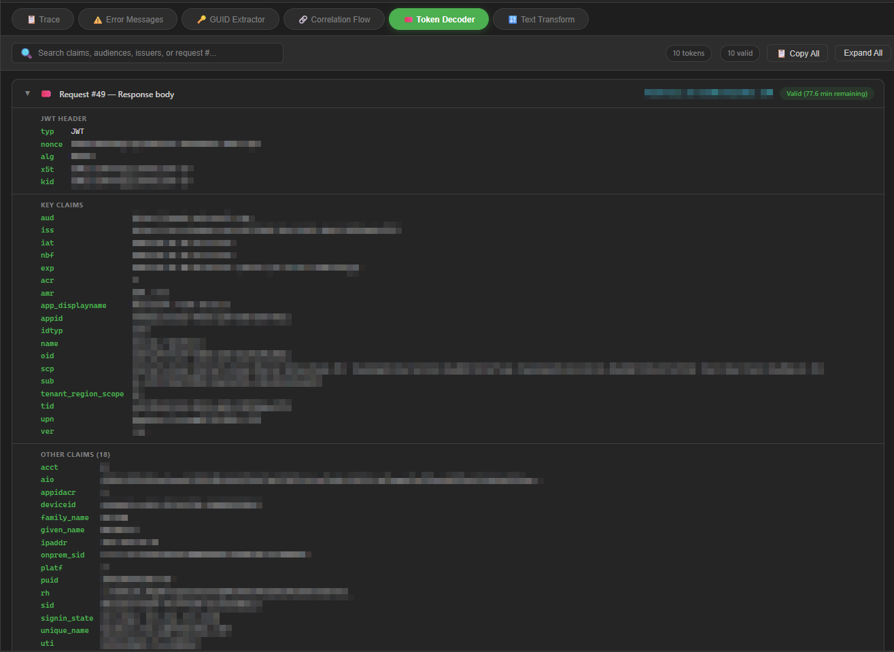
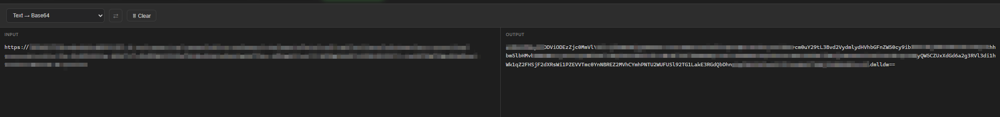

# 🔬 pHARser

A single-page HAR (HTTP Archive) network trace analyzer. Runs entirely in the browser — no data leaves your machine.

**[Live Demo →](https://pharser.azurewebsites.net)**

---

## Features

### Trace View

- Sortable request table with method, status, domain, path, type, size, time, and waterfall
- Resizable Domain and Path columns (drag column header edge)
- Search with scope selector: everywhere, domain-only, or path-only
- Filters: method, status group, domain, resource type
- Quick filters: errors (4xx/5xx), slow requests, large responses, flagged
- Flag requests for triage; copy flagged requests or full responses via context menu
- **Exclude domain**: right-click any request → "Exclude domain" to permanently remove all entries for that domain, freeing memory on large traces. Excluded domains appear as chips in the sidebar; click ✕ to restore (re-parses original HAR).

### Detail Pane

Tabs: **Headers** · **Payload** · **Response** · **Timing** · **Raw**
- Per-section and per-row copy (📋) and send-to-Text-Transform (🔣) buttons
- Timing breakdown with waterfall visualization
- Raw HAR entry JSON view

### Error Messages

Auto-extracted error messages from response bodies with status/source context.

### GUID Extractor

Scans all requests/responses for GUIDs. Click to filter the trace by correlation ID.

### Correlation Flow

Groups requests by shared GUIDs to visualize request chains across services.

### Token Decoder

Detects and decodes JWT tokens from Authorization headers. Shows header, payload, and expiry.

### Text Transform

Encode/decode utility with 20+ modes:

| Category | Modes |
|----------|-------|
| Encoding | Base64, URL, Hex, HTML entities, UTF-7 |
| Hashing | MD5, SHA-1, SHA-256, SHA-384, SHA-512 |
| Formats | C# byte[], JS string literal |
| SAML | Deflate + Base64 (decode) |

Auto-transforms on input. Swap input↔output with one click.

### Insights Panel
Automated analysis: auth token changes, CORS issues, redirect chains, mixed content, slow requests, error clusters.

---

## Usage

1. Open [pharser.azurewebsites.net](https://pharser.azurewebsites.net)
2. Drop a `.har` or `.json` file (or click **Open HAR File**)
3. Browse, filter, and inspect

Keyboard: `Ctrl+B` toggles sidebar.

---

## Tech Stack

- Single `index.html` — vanilla HTML/CSS/JS, no frameworks, no dependencies
- Dark theme with CSS custom properties
- Web Crypto API for hashing (SHA family)
- CompressionStream API for SAML deflate
- Node.js `server.js` for hosting + visit/HAR counters on Azure App Service
- Azure Application Insights for telemetry

## Privacy

All HAR processing happens locally in your browser. No file data is uploaded. The only network calls are the page visit counter and Application Insights telemetry (no HAR content is sent).

## Deployment

Hosted on Azure App Service. GitHub Actions workflow deploys on push to `master`.

## Feedback

Use the in-app feedback form or [open an issue](https://github.com/AMBIENTCORE/pHARser/issues).
